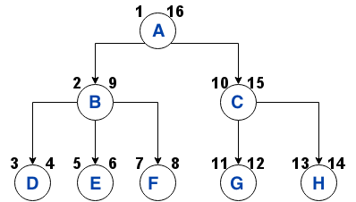

# NestedSet
R nested set


Tree exemple




result

```{r}
  id name pathString id_parent total_child_count lft rgt leafCount
1  1    A          A        NA                 1   1  16         5
2  2    B        A/B         1                 2   2   9         3
3  3    D      A/B/D         2                 3   3   4         1
4  4    E      A/B/E         2                 3   5   6         1
5  5    F      A/B/F         2                 3   7   8         1
6  6    C        A/C         1                 2  10  15         2
7  7    G      A/C/G         6                 3  11  12         1
8  8    H      A/C/H         6                 3  13  14         1
```
